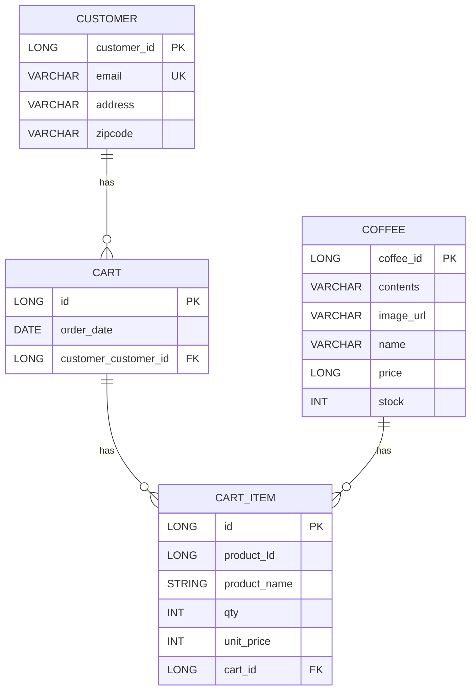
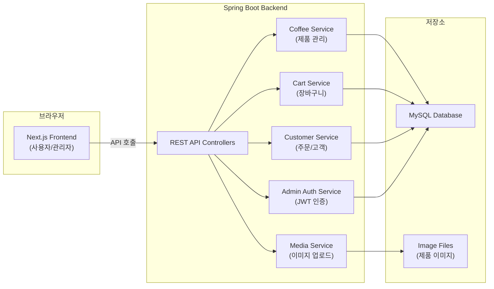
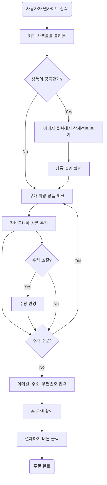
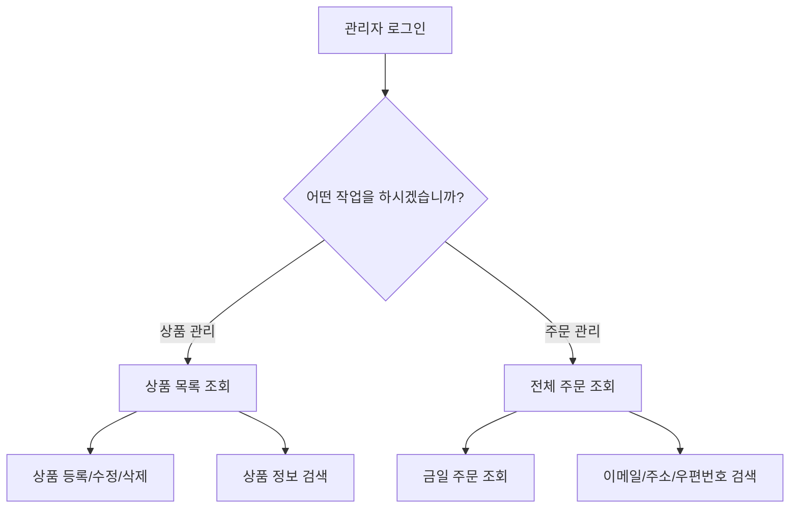

# ☕ Grids & Circles - Online Coffee Ordering System

> 작은 로컬 카페 **“Grids & Circles”** 의 온라인 주문 관리 시스템  
> 고객은 웹사이트를 통해 커피 원두 패키지를 주문하고, 매일 **오후 2시 기준**으로 주문이 취합되어 배송됩니다.  

---

## ✨ 프로젝트 개요

- **프로젝트명:** Grids & Circles Online Coffee Ordering  
- **목표:** 소규모 카페의 온라인 주문 시스템을 구축하여, 고객 편의성과 주문 효율성을 높임  
- **주요 특징:**
  - 별도의 회원가입 없이 **이메일 기반 주문**
  - 하루 주문을 **오후 2시 기준으로 취합**
  - 동일 고객이 하루에 여러 번 주문하더라도, **하나의 배송 단위로 합산**
  - 기본 제공 상품 4종 관리 (CRUD)  
---

## 팀원
|[김예진](https://github.com/dpwls8984)|[박종원](https://github.com/premierbell)|[백승범](https://github.com/BackSeungBeom)|
|:-:|:-:|:-:|
||||
|BE|BE|FE,BE|


## 🛠️ 역할 분담

| 이름   | 담당 기능 |
|--------|-----------|
| **김예진** | - 장바구니 수량 수정<br>- 장바구니 상품 추가<br>- [관리자] 인증, 주문/상품 관리 |
| **박종원** | - 유저 생성|
| **백승범** | - 장바구니 조회<br>- 장바구니 삭제<br>- 상품 CRUD<br>- 프론트엔드 |
---

## 📖 시나리오

- 고객은 웹사이트에 접속하여 커피 원두 상품을 장바구니에 담아 주문  
- 주문 시 이메일을 입력하여 고객을 구분  
- **주문 처리 규칙:**
  - **전날 오후 2시 ~ 당일 오후 2시 주문** → 당일 배송 시작  
  - **오후 2시 이후 주문** → 다음 날 배송 시작  
- 안내 문구:  
  > "당일 오후 2시 이후의 주문 건은 다음 날 배송이 시작됩니다."  

---
## 🔎 주요 기능
### 📦 상품

| 역할     | 기능                                       |
|--------|--------------------------------------------|
| 사용자  | 상품 조회, 세부 설명 조회                    |
| 관리자  | 상품 등록, 수정, 삭제, 조회 (CRUD) |


### 🛒 주문

| 역할     | 기능                            |
|--------|---------------------------------|
| 사용자 | 주문 생성, 정보 입력 |
| 관리자 | 전체 사용자 주문 내역 조회, 금일 주문 조회 |


---

## 🛠️ 기술 스택

### Backend
- **Java 21** : 최신 LTS 이후 버전 사용, 성능 및 언어 기능 향상
- **Spring Boot 3.5.6** : 애플리케이션 프레임워크
- **Spring Data JPA (Hibernate)** : ORM 기반 데이터 액세스 계층

### Database
- **H2 Database** : 개발 및 테스트 환경용 인메모리/파일형 DB
- **MySQL** : 운영 환경용 RDBMS
- **MySQL Connector/J** : MySQL 연결 드라이버

### Build & Dependency Management
- **Gradle (Kotlin DSL)** : 프로젝트 빌드 및 의존성 관리
- **Spring Dependency Management Plugin (1.1.7)** : BOM 관리

### Development Tools
- **IntelliJ IDEA** : 주요 개발 환경 (IDE)
- **Spring Boot DevTools** : 개발 편의 기능 (자동 리스타트 등)
- **Lombok** : 반복 코드 제거 (Getter, Setter, Builder 자동 생성)


---

## 📂 프로젝트 구조

```bash
backend/src/main/java/com/mysite/
├── CuffeeApplication.java           # 메인 애플리케이션 클래스 (Spring Boot 실행 진입점)
│
├── cuffee/                          # 서비스 주요 도메인
│   ├── admin/                       # 관리자 기능
│   │   ├── controller/              # 관리자 전용 컨트롤러 (주문/상품 관리)
│   │   ├── service/                 # 관리자 비즈니스 로직
│   │   └── dto/                     # 관리자 전용 요청/응답 DTO
│   │
│   ├── cart/                        # 장바구니 기능
│   │   ├── controller/              # 장바구니 API 컨트롤러
│   │   ├── service/                 # 장바구니 관련 비즈니스 로직
│   │   ├── dto/                     # 장바구니 요청/응답 DTO
│   │   ├── entity/                  # 장바구니 엔티티 (Cart, CartItem 등)
│   │   └── repository/              # 장바구니 JPA 리포지토리
│   │
│   ├── customer/                    # 사용자(고객) 관리
│   │   ├── controller/              # 고객 API 컨트롤러
│   │   ├── service/                 # 고객 서비스 로직
│   │   ├── entity/                  # 고객 엔티티 (Customer 등)
│   │   └── repository/              # 고객 리포지토리
│   │
│   ├── media/                       # 이미지/파일 업로드 관리
│   │   ├── controller/              # 파일 업로드/조회 API
│   │   └── service/                 # 미디어 저장/처리 로직
│   │
│   └── products/                    # 상품 관리
│       ├── controller/              # 상품 API 컨트롤러
│       ├── service/                 # 상품 서비스 로직
│       ├── dto/                     # 상품 요청/응답 DTO
│       ├── entity/                  # 상품 엔티티 (Product, Category 등)
│       └── repository/              # 상품 리포지토리
│
└── global/                          # 전역 설정 및 공통 모듈
    ├── exception/                   # 서비스 전용 예외 클래스
    ├── jpa.entity/                  # 공통 JPA 엔티티 (BaseEntity 등)
    ├── rsData/                      # 응답 데이터 포맷 표준화 (RsData<T>)
    ├── security/                    # Swagger(OpenAPI) 전역 보안 설정
    └── Util/                        # JWT 토큰 유틸 

```
---
##  📊 ERD

---
## 🔄 시스템 구상도

---
## 🌳 사용자 플로우

## 🕵 관리자 플로우

---
## 결과 페이지
### 상품 조회 및 주문 페이지
> 사용자가 페이지에 진입했을 때 보이는 페이지입니다. 장바구니에 상품 조회/추가/삭제 및 수량 조절이 가능합니다.


### 상품 주문
> 사용자는 장바구니에 구매하고자 하는 상품을 담은 후 정보를 입력합니다. 이때 장바구니에 상품이 담겨져있고 사용자의 정보가 입력되어야 '결제하기' 버튼이 활성화됩니다.


### [관리자] 로그인 페이지
> 관리자 로그인 페이지입니다. 지정된 아이디/비밀번호로만 로그인이 가능합니다.


### [관리자] 주문 관리 페이지
> 관리자 주문 관리 페이지입니다. 관리자는 전체 주문 내역을 조회 가능합니다.


### [관리자] 금일 주문 조회 페이지
> '금일 주문' 버튼을 누르면 전날 오후 2시부터 금일 오후 2시까지의 주문 내역이 조회됩니다.


### [관리자] 상품 관리 페이지
> 관리자 상품 관리 페이지입니다. 관리자는 전체 상품 목록을 조회 가능하며, 상품에 대한 정보를 수정 가능합니다.


### [관리자] 상품 수정 페이지
> '수정'버튼 클릭시 상품에 대한 세부 정보를 수정 할 수 있습니다.


---

## 코딩 컨벤션
| feat | 새로운 기능을 추가 |
| --- | --- |
| fix | 버그 수정 |
| design | CSS 등 사용자 UI 디자인 변경 |
| !BREAKING CHANGE | 커다란 API 변경의 경우 |
| !HOTFIX | 급하게 치명적인 버그를 고쳐야하는 경우 |
| style | 코드 포맷 변경, 세미 콜론 누락, 코드 수정이 없는 경우 |
| refactor | 프로덕션 코드 리팩토링 |
| comment | 필요한 주석 추가 및 변경 |
| docs | 문서 수정 |
| test | 테스트 코드, 리펙토링 테스트 코드 추가, Production Code(실제로 사용하는 코드) 변경 없음 |
| chore | 빌드 업무 수정, 패키지 매니저 수정, 패키지 관리자 구성 등 업데이트, Production Code 변경 없음 |
| rename | 파일 혹은 폴더명을 수정하거나 옮기는 작업만인 경우 |
| remove | 파일을 삭제하는 작업만 수행한 경우 |
| init | 초기 생성, 꼭 필요한 라이브러리 설치하는 경우 |

---

## API

<details>
<summary> API 바로보기 </summary>
<div markdown="1">

<br>
<table>
  <thead>
    <tr>
      <th>카테고리</th>
      <th>기능</th>
      <th>HTTP 메서드</th>
      <th>API Path</th>
      <th>Request</th>
      <th>Response</th>
    </tr>
  </thead>
  <tbody>
    <tr><td>상품</td><td>메인(목록)</td><td>GET</td><td>/coffee/products</td><td>-</td><td>☕ CoffeeResponseDto</td></tr>
    <tr><td>상품</td><td>단건 조회</td><td>GET</td><td>/coffee/{coffeeId}</td><td>Query: coffeeId</td><td>☕ CoffeeResponseDto</td></tr>
    <tr><td>미디어</td><td>이미지 업로드</td><td>POST</td><td>/coffee/products/image</td><td>multipart/form-data(file)</td><td>📂 UploadRes</td></tr>
    <tr><td>미디어</td><td>이미지 삭제</td><td>DELETE</td><td>/coffee/products/image?imageUrl=...</td><td>Query: imageUrl</td><td>-</td></tr>
    <tr><td>미디어</td><td>이미지 교체(업로드+기존 삭제)</td><td>PUT</td><td>/coffee/products/image</td><td>multipart/form-data(file, oldImageUrl)</td><td>📂 UploadRes</td></tr>
    <tr><td>장바구니</td><td>생성</td><td>POST</td><td>/coffee/carts</td><td>-</td><td>🛒 NewCartResBody</td></tr>
    <tr><td>장바구니</td><td>항목 추가</td><td>POST</td><td>/coffee/carts/items</td><td>📝 AddToCartReqBody</td><td>-</td></tr>
    <tr><td>장바구니</td><td>항목 삭제</td><td>DELETE</td><td>/coffee/carts/{cartId}/items/{id}</td><td>Query: cartId, productId</td><td>-</td></tr>
    <tr><td>장바구니</td><td>품목 수량 증가</td><td>POST</td><td>/carts/{cartId}/items/{id}/increase</td><td>Query: cartId, productId</td><td>-</td></tr>
    <tr><td>장바구니</td><td>품목 수량 감소</td><td>POST</td><td>/carts/{cartId}/items/{id}/decrease</td><td>Query: cartId, productId</td><td>-</td></tr>
    <tr><td>장바구니</td><td>조회(요약)</td><td>GET</td><td>/coffee/carts/{cartId}/summary</td><td>Query: cartId</td><td>🛒 GetCartSummaryResBody</td></tr>
    <tr><td>장바구니</td><td>날짜 등록</td><td>POST</td><td>/carts/{cartId}/date</td><td>Query: cartId</td><td>-</td></tr>
    <tr><td>고객</td><td>정보 입력</td><td>POST</td><td>/carts/{cartId}/customer</td><td>📝 PaymentRequest</td><td>-</td></tr>
    <tr><td>관리자</td><td>로그인</td><td>POST</td><td>/admin/login</td><td>📝 LoginRequest</td><td>🔑 LoginResponse</td></tr>
    <tr><td>관리자</td><td>주문 목록</td><td>GET</td><td>/admin/orders</td><td>-</td><td>📦 OrderResponse</td></tr>
    <tr><td>관리자</td><td>일일 배송 대상</td><td>GET</td><td>/admin/orders/dailyBatch</td><td>-</td><td>📦 OrderResp

